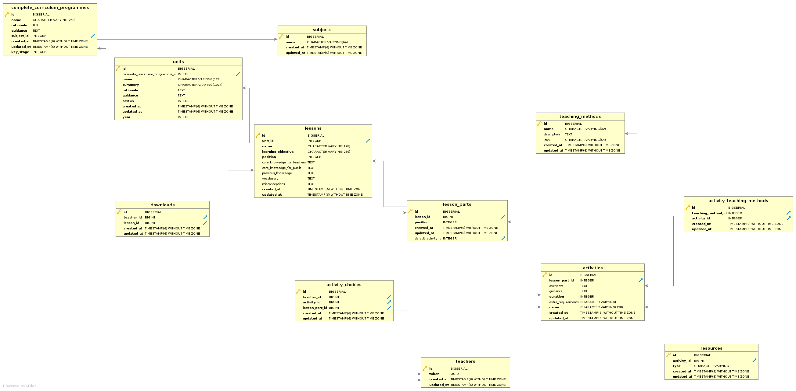

[](https://travis-ci.com/DFE-Digital/curriculum-materials)
[](https://codeclimate.com/github/DFE-Digital/curriculum-materials/maintainability)
[](https://codeclimate.com/github/DFE-Digital/curriculum-materials/test_coverage)

# Curriculum Materials

The curriculum materials project is intended to ease the life of teachers by
allowing them to view, customise and download teaching materials that cover the
entire national curriculum.

## Environments

| Environment | URL                                                  |
| ----------- | --------                                             |
| Staging     | https://dfe-curriculum-materials.herokuapp.com/      |
| Production  | https://dfe-curriculum-materials-prod.herokuapp.com/ |

## Getting started

## Running the application locally

The application is a very standard [Rails](https://www.rubyonrails.org/) application and no
special steps should be required in order to get up and running.

### Locally

#### Prerequisites

Ensure you have the following installed on your machine:

 * Ruby 2.6.5
 * PostgreSQL (with an account that has superuser privileges)
 * NodeJS
 * NPM

Clone the repository:

```bash
$ git clone git@github.com:DFE-Digital/curriculum-materials.git
```

Install bundler and bundle the Ruby gems:

```bash
$ bundle install
```

If your database user needs a password, set that first by editing
`config/database.yml`.  Now run the app:

```bash
$ bundle exec rails db:setup
```

### On Docker

From the application root, build and start the app:

```bash
$ docker build . -t curriculum_materials:latest
$ docker-compose up
```

To stop the app run:

```bash
$ docker-compose down
```

## Running the tests

All of the unit and integration tests are written in [RSpec](https://rspec.info/). Run them
in the conventional manner:

```bash
$ budle exec rspec
```

Hopefully everything should be green!

## Schema



## Lingo

| Word                | Description                                                                                                                                                                                    |
| ----                | -----------                                                                                                                                                                                    |
| CCP                 | Complete Curriculum Programme. A set of lesson materials and guidance that covers one subject for one Key Stage                                                                                |
| Curriculum Designer | The person or persons responsible for creating a CCP                                                                                                                                           |
| EAL                 | English as an additional language                                                                                                                                                              |
| FSM                 | Free School Meals                                                                                                                                                                              |
| LA                  | Local Authority e.g. Local Authority maintained schools                                                                                                                                        |
| MAT                 | Multi-Academy Trusts                                                                                                                                                                           |
| National curriculum | The national curriculum for England to be taught in all local-authority-maintained schools.                                                                                                    |
| PPA                 | Planning, preparation and assessment                                                                                                                                                           |
| Pedagogy            | Pedagogy, taken as an academic discipline, is the study of how knowledge and skills are imparted in an educational context, and it considers the interactions that take place during learning. |
| SEN                 | Special Educational Needs or SEND, Special Educational Needs and Disabilities                                                                                                                  |
| Unit                | A Unit of a CCP refers to the lessons that are delivered over the course of one half term. Normally 6 or 7 weeks                                                                               |

## Contributing

Please ensure that any contributions meet with the [Department for Education's
digital guidelines](https://dfe-digital.github.io/) and that all tests and lint checks
pass.

You can run them all with:

```bash
$ bundle exec rake
```
